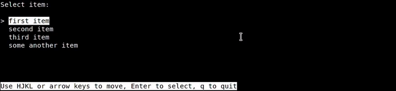
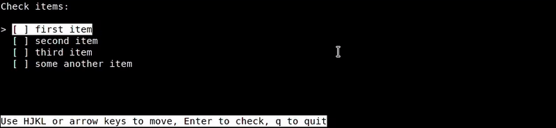

# Interact — Bash powered interactive interfaces

**Interact** — is Bash functions library that implements some interactive elements like menus, checkboxes and others.

You can use Interact instead of Whiptail and Dialog. Interact depends only Bash native commands and basic utils.

# Usage

Clone [lib/interact.bash](lib/interact.bash) in your project and source it:

```shell
source lib/*

# do something
```

# Functions

## menu

Simple menu. Returns string with an item as `SELECTED_ITEM`. Navigation keys: `HJKL` (vim-style), arrow keys and `[`, `]`.



Usage:

```shell
menu "${array[@]}"
echo "$SELECTED_ITEM"
```

Demo script: [menu.sh](menu.sh).

You can override default help text and prompt via variables:

```
MENU_PROMPT   -- string with prompt message;
MENU_INDENT   -- string with intentation chars;
MENU_HELP     -- string with help message.
```

## checklist

Checklist. Returns array of checked items as `CHECKED_ITEMS`. Mostly same as menu, but needed changes. Features: automove to next item, check/uncheck items, variables supported too.



Syntax:

```shell
checklist "${array[@]}"
echo "${CHECKED_ITEMS[@]}"
```

Demo script: [checklist.sh](checklist.sh).

Varisables:
```
CHECK_PROMPT -- string with prompt message;
CHECK_INDENT -- string with intentation chars;
CHECK_HELP   -- string with help message.
```

## messagebox

Just screen with text message. Press any key to close it.

Usage:

```shell
MSGBOX_TITLE='My title'
messagebox 'My message'
```

Demo script: [messagebox.sh](messagebox.sh).

Varisbles:
```
MSGBOX_TITLE    -- title (centered and bold);
MSGBOX_WIDTH    -- terminal width. Default: 75 cols;
MSGBOX_HELP     -- help message.
```

## yesno

Yes/No dialog. You can type Y or N or select item in menu.

Usage:

```shell
if yesno "Question?\n"; then
  do_something
else
  do_nothing
fi
```

Demo script: [yesno.sh](yesno.sh).

Variables:
```
ASSUME_YES  -- skip dialog, return "Yes";
YN_INDENT   -- indent;
YN_HELP     -- help text.
```

# License

[MIT License :)](LICENSE.md)
